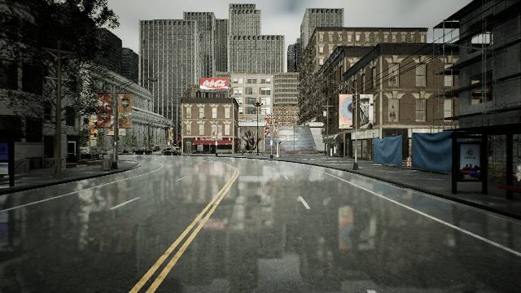
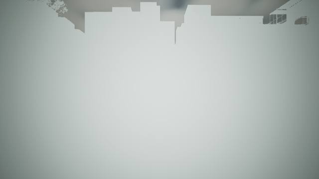

# Live scene weather verification

The separate LiDAR noise controls and loadout rebuild command have been removed. Scene rain, fog and dust feed the native sensor on each scan. Weather edits work during running and recording. The camera uses the same base fog extinction with Unreal unit conversion and visible atmospheric light.

## Runtime evidence

- Native build and 24 relevant controller tests passed; standalone C++ scene-medium checks passed.
- All three native processes map the final rebuilt Carla library (see live-binaries.json).
- Restored 31 managed actors and 2 sensors; maximum position difference on restoration was 0.003766 m.
- Camera 52 and LiDAR 53 remained unchanged throughout all six running/recording weather cases.
- Recording 20260913-211822-9f66aa: 39 frames, 78 sensor samples, no verifier errors or warnings. Every ROS PointCloud2 matched its raw 64-byte point records after the documented coordinate conversion; timestamps matched.
- Dense fog took effect on the applied frame, with zero surface returns at frame 270.

| Scene condition | Mean surface returns beyond 20 m | Mean atmospheric returns |
|---|---:|---:|
| clear | 3511.5 | 0.0 |
| moderate_fog | 1127.8 | 4423.8 |
| dense_fog | 0.0 | 11867.2 |
| fog_beyond_range | 3522.0 | 0.0 |
| heavy_rain | 22.5 | 6275.2 |
| clear_again | 3402.2 | 0.0 |

## Captures

Clear fog/rain (road wetness retained):

100% fog beginning at 0 m:

## Current scene and interpretation

The current scene is paused, with fog density 100%, fog starting at 0 m, and the existing 70% rain retained. Use Run, then Weather → Apply weather to change weather live. Clearing fog uses density 0%. The old 100 m fog onset was beyond the 80 m LiDAR range.

Dense fog can block detectable surface echoes while still producing nearby atmospheric backscatter. Zero surface echoes does not imply an empty point cloud. The generic percentage-to-extinction mapping is uncalibrated. Camera height falloff and LiDAR receiver physics can produce different visibility. Semantic LiDAR remains geometric.

Implementation details: [weather documentation](../../docs/lidar-weather.md). Full evidence: report.json, recording-verification.json, live-binaries.json, test-control.log, test-medium.log, build-native.log, build-camera-fog.log.
